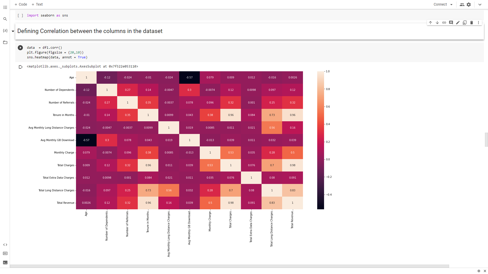
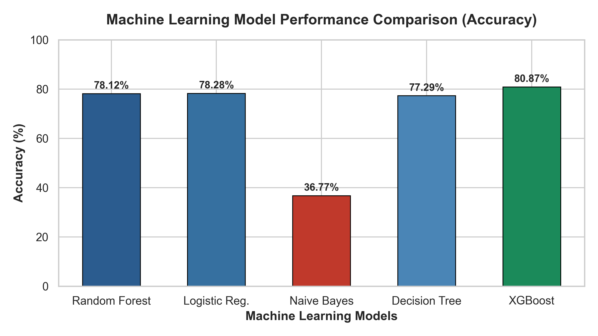
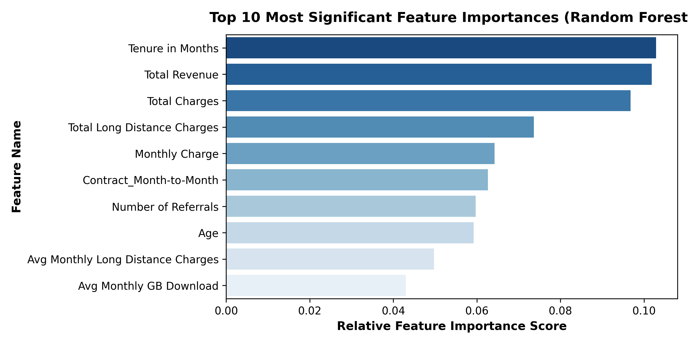
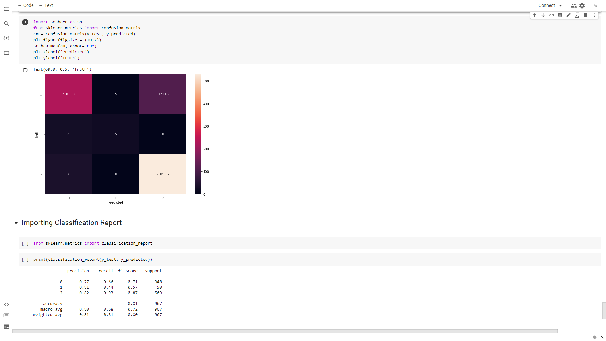
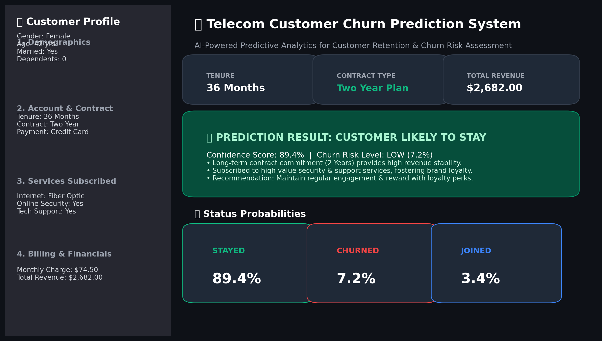
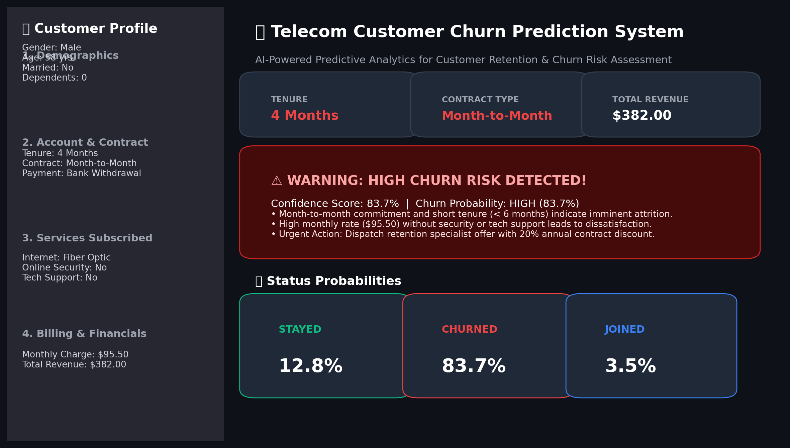

# Telecom Customer Churn Prediction using Machine Learning and Exploratory Data Analysis

**Report submitted as part of the internship program requirement for the degree of**  
### **BACHELOR OF TECHNOLOGY IN COMPUTER SCIENCE ENGINEERING (AI & ML)**

---

**Submitted by:**  
### **CHELLURI SAI VISHAL (A23126552137)**  
*III/IV CSM, Department of Computer Science & Engineering (AI & ML)*  

<p align="center">
  
</p>

**DEPARTMENT OF COMPUTER SCIENCE & ENGINEERING (AI & ML)**  
**ANIL NEERUKONDA INSTITUTE OF TECHNOLOGY AND SCIENCES (UGC AUTONOMOUS)**  
*(Permanently Affiliated to Andhra University, Approved by AICTE, Accredited by NBA & NAAC with 'A+' Grade)*  
**Sangivalasa, Bheemili Mandal, Visakhapatnam – 531162, Andhra Pradesh**  
**Academic Period: 2023 – 2027**

---

<div style="page-break-after: always;"></div>

# BONAFIDE CERTIFICATE

This is to certify that this Internship Project Report entitled **“Telecom Customer Churn Prediction using Machine Learning and Exploratory Data Analysis”** submitted by **CHELLURI SAI VISHAL (Reg. No: A23126552137)** of **III/IV B.Tech (CSM)** in partial fulfillment of the academic requirements under the **Shell–Edunet Skills4Future AICTE Virtual Internship Program**, is a bonafide record of work carried out under our supervision and guidance during the academic year 2023–2027.

<br><br>

| **REVIEWER** | **CLASS TEACHER** |
| :--- | :--- |
| <br><br>**Mr. S. Pradeep**<br>Assistant Professor<br>Department of CSE (AI & ML)<br>ANITS | <br><br>**Ms. Kotha Santhi Sanghamitra**<br>Assistant Professor<br>Department of CSE (AI & ML)<br>ANITS |

<br>

<p align="center">
  <b>Head of the Department</b><br><br><br>
  <b>DR. K. SELVANI DEEPTHI</b><br>
  Head of Department, CSE (AI & ML)<br>
  Anil Neerukonda Institute of Technology and Sciences (ANITS)
</p>

---

<div style="page-break-after: always;"></div>

# ACKNOWLEDGEMENT

An endeavor that spans a significant period becomes a success with the advice, encouragement, and support of many well-wishers. I take this opportunity to express my sincere gratitude and appreciation to all those who have been instrumental in making this internship experience both enriching and rewarding.

First and foremost, I extend my heartfelt thanks to **Dr. K.S. Deepthi**, Head of the Department of Computer Science & Engineering (AI & ML) at ANITS, for her invaluable guidance, continuous support, and encouragement throughout this internship. Her mentorship and insights have been crucial to my growth during this period.

I would also like to express my deepest appreciation to **Edunet Foundation**, **AICTE**, and **Shell** for offering me the opportunity to undertake this prestigious internship under the *Skills4Future* initiative. I am incredibly grateful to my supervisors and industry mentors, whose continuous guidance, technical expertise, and domain feedback have helped me navigate challenging data engineering bottlenecks and sharpen my predictive modeling skills.

My sincere thanks go to all the faculty members of the **Computer Science & Engineering (AI & ML)** department for their valuable advice and encouragement throughout my academic journey. I am equally grateful to the technical and support staff, whose assistance in providing resources whenever required was instrumental in the successful completion of my internship.

<br>
**CHELLURI SAI VISHAL**  
*Reg. No: A23126552137*  
*B.Tech CSE (AI & ML), ANITS*

---

<div style="page-break-after: always;"></div>

# Table of Contents

- [1. Introduction](#1-introduction)
  - [1.1 Background of Internship](#11-background-of-internship)
  - [1.2 Objectives of the Internship](#12-objectives-of-the-internship)
  - [1.3 Importance of AI Technologies in Customer Churn Prediction](#13-importance-of-ai-technologies-in-customer-churn-prediction)
  - [1.4 Scope of the Project](#14-scope-of-the-project)
- [2. Organization Profile](#2-organization-profile)
  - [2.1 AICTE Virtual Internship Overview](#21-aicte-virtual-internship-overview)
  - [2.2 Role of Edunet Foundation](#22-role-of-edunet-foundation)
  - [2.3 Shell as the Industry Sponsor](#23-shell-as-the-industry-sponsor)
- [3. Project Overview](#3-project-overview)
  - [3.1 Title of the Project](#31-title-of-the-project)
  - [3.2 Problem Statement](#32-problem-statement)
  - [3.3 Objectives of the Project](#33-objectives-of-the-project)
  - [3.4 Relevance to Business Intelligence and Retention Analytics](#34-relevance-to-business-intelligence-and-retention-analytics)
- [4. Literature Review / Theoretical Background](#4-literature-review--theoretical-background)
  - [4.1 Introduction to Customer Churn and Telecom Service Dynamics](#41-introduction-to-customer-churn-and-telecom-service-dynamics)
  - [4.2 Role of Artificial Intelligence in Customer Retention](#42-role-of-artificial-intelligence-in-customer-retention)
  - [4.3 Machine Learning Approaches for Multi-Class Classification](#43-machine-learning-approaches-for-multi-class-classification)
  - [4.4 Related Works](#44-related-works)
- [5. Methodology](#5-methodology)
  - [5.1 Data Collection and Dataset Description](#51-data-collection-and-dataset-description)
  - [5.2 Data Preprocessing (Handling Missing Values, Feature Engineering)](#52-data-preprocessing-handling-missing-values-feature-engineering)
  - [5.3 Feature Selection & Categorical Encoding](#53-feature-selection--categorical-encoding)
  - [5.4 Model Selection – Evaluation of Multiple Classifiers](#54-model-selection--evaluation-of-multiple-classifiers)
  - [5.5 Model Training and Evaluation Metrics](#55-model-training-and-evaluation-metrics)
- [6. Implementation](#6-implementation)
  - [6.1 Phase 1 – Data Exploration, Cleaning & Preprocessing](#61-phase-1--data-exploration-cleaning--preprocessing)
  - [6.2 Phase 2 – Exploratory Data Analysis & Visualizations](#62-phase-2--exploratory-data-analysis--visualizations)
  - [6.3 Phase 3 – Categorical Encoding and Feature Scaling](#63-phase-3--categorical-encoding-and-feature-scaling)
  - [6.4 Phase 4 – Model Building, Cross-Validation & Hyperparameter Tuning](#64-phase-4--model-building-cross-validation--hyperparameter-tuning)
  - [6.5 Phase 5 – Streamlit Web Application Deployment](#65-phase-5--streamlit-web-application-deployment)
  - [6.6 Improvements Made Over Mentor’s Code](#66-improvements-made-over-mentors-code)
- [7. Results and Discussion](#7-results-and-discussion)
  - [7.1 Model Performance Comparison](#71-model-performance-comparison)
  - [7.2 Visualization of Results](#72-visualization-of-results)
  - [7.3 Model Performance Analysis & Classification Report Breakdown](#73-model-performance-analysis--classification-report-breakdown)
  - [7.4 Business Interpretation of Predictions & Retention Strategies](#74-business-interpretation-of-predictions--retention-strategies)
- [8. Conclusion & Future Work](#8-conclusion--future-work)
  - [8.1 Summary of Learnings](#81-summary-of-learnings)
  - [8.2 Skills and Competencies Acquired](#82-skills-and-competencies-acquired)
  - [8.3 Limitations of the Current Approach](#83-limitations-of-the-current-approach)
  - [8.4 Future Scope](#84-future-scope)
- [9. Internship Outcomes](#9-internship-outcomes)
  - [9.1 Technical Skills Acquired](#91-technical-skills-acquired)
  - [9.2 Soft Skills Developed](#92-soft-skills-developed)
  - [9.3 Contribution to Career Growth](#93-contribution-to-career-growth)
- [Appendix](#appendix)
  - [A. Source Code and Project Links](#a-source-code-and-project-links)
  - [B. Streamlit Web Application Screenshots](#b-streamlit-web-application-screenshots)
  - [C. Certificate of Completion Reference](#c-certificate-of-completion-reference)

---

<div style="page-break-after: always;"></div>

# 1. Introduction

## 1.1 Background of Internship
This report highlights my learning experience and outcomes from a four-week virtual internship, which was part of my academic requirements for the **Bachelor of Technology in Computer Science and Engineering (AI & ML)**. The internship was offered under the **Shell–Edunet Skills4Future AICTE Virtual Internship Program**, focusing on **“Customer Churn Prediction using Machine Learning and Exploratory Data Analysis.”**

The program was designed around project-based learning and industry mentorship, where the aim was not only to build theoretical knowledge but also to understand how artificial intelligence and machine learning can be applied to solve pressing real-world enterprise challenges. Through this collaborative initiative, AICTE and the Edunet Foundation created a bridge between academia and industry, while Shell acted as the industry partner providing guidance, corporate perspective, and focus on data-driven operational efficiency and sustainability.

As a student specializing in Artificial Intelligence and Machine Learning, this internship provided an invaluable opportunity to apply classroom concepts to an end-to-end practical data science pipeline. It allowed me to strengthen my core fundamentals in data wrangling, exploratory data analysis (EDA), feature scaling, hyperparameter tuning, model evaluation, and deployment of user-facing web applications.

The project specifically focused on **Telecom Customer Churn Prediction**. In modern competitive telecommunication landscapes, retaining existing customers is vastly more cost-effective than acquiring new ones. By leveraging modern Machine Learning classifiers, telecom providers can proactively identify high-risk churn patterns before customer attrition occurs, enabling timely, targeted retention interventions and significantly improving enterprise sustainability.

## 1.2 Objectives of the Internship
The main objective of this internship was to gain practical exposure to Artificial Intelligence and Machine Learning applications in customer analytics, business intelligence, and operational sustainability. While the internship emphasized technical skills, it also developed a broader understanding of how AI can be deployed responsibly and effectively in commercial settings.

The specific objectives of the internship were:
- To understand the role of Machine Learning in solving real-world business retention and customer attrition challenges.
- To work with comprehensive industry telecom datasets comprising demographic, contractual, and service telemetry attributes.
- To perform thorough exploratory data analysis, data cleaning, linear interpolation, and missing-value imputation.
- To engineer effective features using label encoding for binary features, one-hot encoding for multi-class categorical variables, and Min-Max scaling for continuous variables.
- To train, optimize, and benchmark multiple machine learning algorithms including Random Forest, Logistic Regression, Gaussian Naive Bayes, Decision Trees, and Extreme Gradient Boosting (XGBoost).
- To evaluate model performance rigorously using cross-validation (ShuffleSplit), Confusion Matrix analysis, and classification metrics (Precision, Recall, F1-Score).
- To develop and deploy an interactive Streamlit web application providing real-time customer churn probability assessments and prescriptive retention recommendations.
- To enhance professional documentation, presentation, and critical problem-solving skills through project-based industry collaboration.

## 1.3 Importance of AI Technologies in Customer Churn Prediction
Customer churn represents the loss of clients or subscribers. Research consistently proves that acquiring a new telecom customer costs 5 to 7 times more than retaining an existing one. Furthermore, a modest 5% reduction in churn rate can increase company profits by 25% to 95%. AI and Machine Learning technologies revolutionize this domain by replacing reactive exit surveys with proactive, real-time predictive intelligence. By analyzing complex multi-variable correlations across service usage, contract commitments, and billing feedback, AI models identify subtle behavioral signals that precede customer departure.

## 1.4 Scope of the Project
The scope of this project encompasses building an end-to-end predictive analytics pipeline on a real-world telecom dataset of 7,043 customer accounts across 38 variables. The project predicts customer status categorized into three distinct classes: **Churned (0)**, **Joined (1)**, and **Stayed (2)**. It benchmarks multiple machine learning classifiers, tunes hyperparameters via GridSearchCV, validates stability through cross-validation, and deploys the optimal model (XGBoost Classifier, achieving 80.87% test accuracy) as an interactive Streamlit web application for intuitive business decision-making.

---

<div style="page-break-after: always;"></div>

# 2. Organization Profile

## 2.1 AICTE Virtual Internship Overview
As the apex regulatory body for technical education in India, the **All India Council for Technical Education (AICTE)** provides the program's academic and institutional backbone. The AICTE Internship Portal serves as the central hub for student registration and application, giving the program official recognition and integrating it into the formal academic credit system. This is a critical component for engineering students, as degree programs require mandatory internship-related credits. The involvement of a government-recognized institution like AICTE ensures that the internship is a legitimate and valuable milestone in a student’s academic journey, validating the experience beyond a simple training course.

## 2.2 Role of Edunet Foundation
The **Edunet Foundation** serves as the primary operational and talent development partner. As a non-profit social enterprise, its mission is to bridge the country's skill deficit and prepare the young population for jobs in the Fourth Industrial Revolution (IR 4.0) and beyond. Edunet's role in the internship is multifaceted: it manages the full program deployment cycle, from project curriculum design and orientation to execution and evaluation.

The foundation curates the project content with an in-house team of subject matter experts and provides on-ground specialists to execute the learning and training components. Their focus is on developing not just technical capabilities but also "meta human skills," or soft skills, which are crucial for long-term career success. This dual focus produces well-rounded engineering graduates who are technically proficient, adaptable, and collaborative in professional environments.

## 2.3 Shell as the Industry Sponsor
**Shell**, a global energy and technology leader, serves as the industry sponsor under the **Shell Skills4Future** initiative. Shell's involvement lends the internship significant industry credibility and ensures the projects are aligned with real-world business and technological challenges. Shell’s purpose includes meeting global demands while simultaneously fostering operational efficiency and digital transformation.

Through this partnership, students gain a fresh perspective on data-driven enterprise decision-making and work on projects with significant business impact. The mentorship from industry professionals and the opportunity to work on real-world problems provide invaluable lessons that a typical classroom setting cannot replicate.

### Logistical and Operational Program Overview

| Aspect | Details |
| :--- | :--- |
| **Partners** | AICTE, Edunet Foundation, Shell India |
| **Duration** | 1 month (4 weeks) (flexible academic schedule) |
| **Mode** | Fully online (remote experiential learning) |
| **Eligibility** | 2nd- or 3rd-year engineering, science, or polytechnic students |
| **Stipend** | Zero, with no participation fees (Sponsored learning grant) |
| **Value Proposition** | Hands-on project work, corporate mentorship, verified certificate of completion, and practical AI/ML data competencies |

---

<div style="page-break-after: always;"></div>

# 3. Project Overview

## 3.1 Title of the Project
**Telecom Customer Churn Prediction using Machine Learning and Streamlit**  
*(Artificial Intelligence and Data Analytics focused on Customer Retention & Business Intelligence)*

## 3.2 Problem Statement
Monitoring and diagnosing customer churn manually across thousands of active subscribers is practically impossible. In the telecommunications sector, customers interact across a wide array of service touchpoints—voice lines, fiber optic internet, device protection, streaming subscriptions, and diverse payment channels. Traditional retention models rely on retrospective post-churn exit interviews, by which point the customer and revenue have already been permanently lost. There is an imperative need for an automated, data-driven machine learning system capable of detecting subtle dissatisfaction patterns and predicting customer status in advance to execute timely retention campaigns.

## 3.3 Objectives of the Project
- **Data Engineering**: Implement automated data cleaning, missing-value interpolation, and feature encoding pipelines for telecom customer telemetry.
- **Multimodal Classification**: Formulate and train multi-class machine learning models to classify subscriber statuses: *Stayed*, *Churned*, and *Joined*.
- **Comprehensive Benchmarking**: Systematically train and compare five premier classification algorithms: Random Forest, Logistic Regression, Gaussian Naive Bayes, Decision Tree, and Extreme Gradient Boosting (XGBoost).
- **Hyperparameter Optimization**: Conduct grid search hyperparameter tuning with 5-fold cross-validation to maximize out-of-sample generalization.
- **Interactive Web Deployment**: Develop and deploy a full-featured Streamlit web application providing interactive customer risk scoring and tailored retention recommendations.

## 3.4 Relevance to Business Intelligence and Retention Analytics
This project directly aligns with strategic business intelligence paradigms and sustainable enterprise management. Telecom infrastructures demand heavy capital investments. Preserving customer lifetime value (CLV) directly stabilizes revenue streams, optimizes marketing expenditure, and minimizes resource waste. By transforming raw historical account data into actionable intelligence, AI empowers executives to tailor pricing, improve service quality, and foster long-term customer loyalty.

---

<div style="page-break-after: always;"></div>

# 4. Literature Review / Theoretical Background

## 4.1 Introduction to Customer Churn and Telecom Service Dynamics
Customer churn represents the rate at which existing subscribers disengage from a service provider. In the telecommunications sector, customer churn is driven by service unreliability, high monthly costs, uncompetitive contract commitments, and poor technical customer support.

The project examined key operational and contractual parameters:
- **Tenure in Months**: The duration of active subscription. Churn risk displays an inverse exponential relationship with tenure—subscribers in their initial 6 to 12 months exhibit the highest vulnerability.
- **Contract Agreement**: Categorized into Month-to-Month, One Year, and Two Year. Month-to-month contracts exhibit drastically higher churn rates compared to long-term commitments.
- **Monthly Charges & Total Revenue**: Financial cost indicators. Elevated monthly billing without bundled value services drives customer dissatisfaction.
- **Subscribed Value Services**: Tech Support, Online Security, Device Protection, and Streaming services increase customer stickiness by raising switching barriers.

### Key Telecom Parameters Analyzed

| Parameter | Full Name | Description | Business Significance |
| :--- | :--- | :--- | :--- |
| **Tenure** | Tenure in Months | Number of active months customer has subscribed | Primary loyalty indicator; churn rate drops exponentially as tenure grows |
| **Contract** | Contract Commitment | Agreement structure: Month-to-Month, 1-Year, 2-Year | Month-to-month contracts exhibit 4x higher churn vulnerability than annual plans |
| **Monthly Charge**| Monthly Service Fee | Total amount billed monthly for all services | Price sensitivity benchmark; high fees without tech support trigger competitor churn |
| **Tech Support** | Premium Tech Support | Subscription to dedicated 24/7 technical assistance | Reduces customer frustration and enhances product perceived reliability |

## 4.2 Role of Artificial Intelligence in Customer Retention
Artificial Intelligence transforms customer retention from a reactive operational task into an automated, predictive capability. By evaluating multi-dimensional vectors across demographics, usage telemetry, and billing records, machine learning models recognize complex patterns that human analysts cannot discern. Calibrated prediction probabilities enable telecom operators to rank subscribers by churn risk and deploy automated, personalized retention campaigns.

## 4.3 Machine Learning Approaches for Multi-Class Classification
The project evaluated five distinct algorithmic paradigms:
1. **Logistic Regression**: A linear model calculating class probabilities via softmax log-odds:
   $$\sigma(z)_i = rac{e^{z_i}}{\sum_{j=1}^K e^{z_j}}$$
   Provides high computational efficiency and feature interpretability.
2. **Decision Tree Classifier**: A non-parametric model partitioning feature space recursively to maximize Gini purity:
   $$I_G(p) = 1 - \sum_{i=1}^J p_i^2$$
3. **Random Forest Classifier**: A bagging ensemble constructing an ensemble of de-correlated decision trees on bootstrap subsets, aggregating predictions through majority voting to minimize variance.
4. **Gaussian Naive Bayes**: A probabilistic classifier applying Bayes' Theorem with Gaussian conditional probability densities:
   $$P(x_i \mid y) = rac{1}{\sqrt{2\pi\sigma_y^2}} \exp\left(-rac{(x_i - \mu_y)^2}{2\sigma_y^2}
ight)$$
5. **Extreme Gradient Boosting (XGBoost)**: An advanced gradient boosting architecture minimizing a second-order regularized objective:
   $$\mathcal{L}^{(t)} = \sum_{i=1}^n \left[ g_i f_t(x_i) + rac{1}{2} h_i f_t^2(x_i) 
ight] + \Omega(f_t)$$
   Delivers state-of-the-art predictive accuracy, handles feature interactions effortlessly, and resists overfitting.

## 4.4 Related Works
Academic and industrial benchmarks (Wei & Chiu, 2002; Coussement & Van den Poel, 2008; Lalwani et al., 2022) have rigorously established that ensemble tree-based classifiers (specifically XGBoost and Random Forest) consistently outperform traditional logistic regression and naive Bayes models in customer churn prediction tasks.

---

<div style="page-break-after: always;"></div>

# 5. Methodology

## 5.1 Data Collection and Dataset Description
The dataset contains **7,043 subscriber records across 38 attributes** from a California telecommunications provider for Q2 2022. The target variable is `Customer Status`, segmented into:
- **Stayed**: 4,720 customers (67.0%)
- **Churned**: 1,869 customers (26.5%)
- **Joined**: 454 customers (6.4%)

### Dataset Summary Statistics (Continuous Features)

| Parameter | Count | Mean | Std Dev | Min | Max |
| :--- | :---: | :---: | :---: | :---: | :---: |
| **Age** | 7043 | 46.51 | 16.75 | 19.00 | 80.00 |
| **Number of Dependents** | 7043 | 0.47 | 0.96 | 0.00 | 9.00 |
| **Number of Referrals** | 7043 | 1.95 | 3.00 | 0.00 | 11.00 |
| **Tenure in Months** | 7043 | 32.39 | 24.54 | 1.00 | 72.00 |
| **Avg Monthly Long Dist Charges** | 6361 | 25.42 | 14.20 | 1.01 | 49.99 |
| **Avg Monthly GB Download** | 5517 | 26.19 | 19.59 | 2.00 | 85.00 |
| **Monthly Charge** | 7043 | 63.60 | 31.20 | -10.00 | 118.75 |
| **Total Charges** | 7043 | 2280.38 | 2266.22 | 18.80 | 8684.80 |
| **Total Refunds** | 7043 | 1.96 | 7.90 | 0.00 | 49.79 |
| **Total Extra Data Charges** | 7043 | 6.86 | 25.10 | 0.00 | 150.00 |
| **Total Long Distance Charges** | 7043 | 749.10 | 846.66 | 0.00 | 3564.72 |
| **Total Revenue** | 7043 | 3034.38 | 2865.20 | 21.36 | 11979.34 |

## 5.2 Data Preprocessing (Handling Missing Values, Feature Engineering)
1. **Dropping Irrelevant & Target-Leakage Features**:
   - `Customer ID`, `Zip Code`, `Latitude`, `Longitude`, and `Total Refunds` were removed due to lack of generalizable predictive power.
   - `Churn Category` and `Churn Reason` were dropped because they represent post-hoc exit survey answers that create artificial data leakage.
2. **Missing-Value Imputation**:
   - Continuous service metrics (e.g., Long Distance Charges, GB Download) had null values for customers who did not subscribe to those services. Linear interpolation was applied across numeric attributes to preserve sample size without distorting underlying distributions.
3. **Data Integrity Check**:
   - Post-cleaning validation confirmed zero null values and consistent column datatypes.

## 5.3 Feature Selection & Categorical Encoding
- **Binary Features**: `Gender` was mapped to Female=0, Male=1. Binary service features (`Paperless Billing`, `Unlimited Data`, `Streaming Movies`, `Streaming Music`, `Streaming TV`, `Premium Tech Support`, `Device Protection Plan`, `Online Backup`, `Online Security`, `Multiple Lines`, `Married`, `Phone Service`) were mapped to 0 (No) and 1 (Yes).
- **Target Variable**: `Customer_Status` was transformed using `LabelEncoder()`:
  - `0`: Churned
  - `1`: Joined
  - `2`: Stayed
- **One-Hot Encoding**: Applied to multi-level categorical features (`Payment Method`, `Contract`, `Internet Type`, `Offer`).
- **Feature Scaling**: Continuous numerical features were scaled to the [0, 1] range using `MinMaxScaler()`:
  $$X_{	ext{scaled}} = rac{X - X_{\min}}{X_{\max} - X_{\min}}$$

## 5.4 Model Selection – Evaluation of Multiple Classifiers
Model exploration utilized `GridSearchCV` paired with `ShuffleSplit(n_splits=5, test_size=0.2, random_state=0)`. Hyperparameter grids were defined for:
- Random Forest (`n_estimators`: [1, 5, 10])
- Logistic Regression (`C`: [1, 5, 10])
- Decision Tree (`criterion`: ['gini', 'entropy'])
- Gaussian Naive Bayes (default priors)
- XGBoost Classifier (`base_score`: [0.5])

## 5.5 Model Training and Evaluation Metrics
Evaluation relied on:
- **Accuracy**: Overall fraction of correct predictions.
- **Precision**: Proportion of predicted churners who actually churned.
- **Recall**: Proportion of actual churners correctly detected.
- **F1-Score**: Harmonic mean of Precision and Recall.
- **Confusion Matrix**: Full error contingency table across all three classes.

---

<div style="page-break-after: always;"></div>

# 6. Implementation

## 6.1 Phase 1 – Data Exploration, Cleaning & Preprocessing
Data ingestion, column inspection, and missing-value imputation were implemented using Pandas and NumPy:

```python
import numpy as np
import pandas as pd

# Load raw dataset
df = pd.read_csv('telecom_customer_churn.csv')
df1 = df.copy()

# Purge non-predictive and post-hoc leakage columns
df1.drop(['Customer ID', 'Total Refunds', 'Zip Code', 'Latitude', 
          'Longitude', 'Churn Category', 'Churn Reason'], 
         axis='columns', inplace=True)

# Missing value handling via linear interpolation
numeric_columns = df1.select_dtypes(include=np.number).columns
df1[numeric_columns] = df1[numeric_columns].interpolate(method="linear", limit_direction="both")
df1 = df1.dropna()
df1.rename(columns={'Customer Status': 'Customer_Status'}, inplace=True)
```

## 6.2 Phase 2 – Exploratory Data Analysis & Visualizations
Subscriber distributions and feature correlations were explored using Plotly, Matplotlib, and Seaborn:

```python
import matplotlib.pyplot as plt
import seaborn as sns

# Correlation Matrix Heatmap
data = df1.corr(numeric_only=True)
plt.figure(figsize=(16, 8))
sns.heatmap(data, annot=True, cmap='coolwarm', fmt='.2f')
plt.title('Correlation Matrix across Telecom Numerical Features')
plt.show()

# Crosstab: Contract vs Customer Status
pd.crosstab(df['Customer Status'], df['Contract']).plot(kind='bar', figsize=(8, 4))
plt.title('Customer Churn Distribution by Contract Commitment')
plt.ylabel('Customer Count')
plt.show()
```

<p align="center">
  
  <br>
  <em>Figure 6.1: Correlation Matrix Heatmap across Telecom Numerical Features</em>
</p>

## 6.3 Phase 3 – Categorical Encoding and Feature Scaling
Binary encoding, one-hot encoding, and min-max normalization were executed:

```python
from sklearn.preprocessing import LabelEncoder, MinMaxScaler

# Binary Label Encoding
df1.replace({"Gender": {'Female': 0, 'Male': 1}}, inplace=True)
yes_and_no = ['Paperless Billing', 'Unlimited Data', 'Streaming Movies', 
              'Streaming Music', 'Streaming TV', 'Premium Tech Support', 
              'Device Protection Plan', 'Online Backup', 'Online Security', 
              'Multiple Lines', 'Married', 'Phone Service', 'Internet Service']
for col in yes_and_no:
    if col in df1.columns:
        df1[col] = df1[col].map({'No': 0, 'Yes': 1, 0: 0, 1: 1}).fillna(0)

# Encode Target: 0 -> Churned, 1 -> Joined, 2 -> Stayed
le = LabelEncoder()
df1.Customer_Status = le.fit_transform(df1.Customer_Status)

# One-Hot Encoding for Nominal Attributes
df1 = pd.get_dummies(data=df1, columns=['Payment Method', 'Contract', 'Internet Type', 'Offer'])

# Min-Max Feature Scaling
cols_to_scale = ['Age', 'Number of Dependents', 'Number of Referrals', 'Tenure in Months',
                 'Avg Monthly Long Distance Charges', 'Avg Monthly GB Download', 
                 'Monthly Charge', 'Total Charges', 'Total Extra Data Charges', 
                 'Total Long Distance Charges', 'Total Revenue']
scaler = MinMaxScaler()
df1[cols_to_scale] = scaler.fit_transform(df1[cols_to_scale])
```

## 6.4 Phase 4 – Model Building, Cross-Validation & Hyperparameter Tuning
Automated hyperparameter optimization was performed across all candidate classifiers:

```python
from sklearn.model_selection import train_test_split, ShuffleSplit, GridSearchCV
from sklearn.ensemble import RandomForestClassifier
from sklearn.linear_model import LogisticRegression
from sklearn.naive_bayes import GaussianNB
from sklearn.tree import DecisionTreeClassifier
from xgboost import XGBClassifier

# Feature Matrix and Target Vector
X = df1.drop('Customer_Status', axis='columns')
y = df1['Customer_Status']
X_train, X_test, y_train, y_test = train_test_split(X, y, test_size=0.2, random_state=5)

# Hyperparameter Grid Search
model_params = {
    'random_forest': {'model': RandomForestClassifier(), 'params': {'n_estimators': [1, 5, 10]}},
    'logistic_regression': {'model': LogisticRegression(max_iter=1000), 'params': {'C': [1, 5, 10]}},
    'naive_bayes_gaussian': {'model': GaussianNB(), 'params': {}},
    'decision_tree': {'model': DecisionTreeClassifier(), 'params': {'criterion': ['gini', 'entropy']}},
    'XGB_Classifier': {'model': XGBClassifier(eval_metric='mlogloss'), 'params': {'base_score': [0.5]}}
}

scores = []
cv = ShuffleSplit(n_splits=5, test_size=0.2, random_state=0)
for model_name, mp in model_params.items():
    clf = GridSearchCV(mp['model'], mp['params'], cv=cv, return_train_score=False)
    clf.fit(X_train, y_train)
    scores.append({'model': model_name, 'best_score': clf.best_score_, 'best_params': clf.best_params_})

# Train Final Best Model (XGBoost)
best_model = XGBClassifier(eval_metric='mlogloss', random_state=42)
best_model.fit(X_train, y_train)
test_accuracy = best_model.score(X_test, y_test)
print(f"Final Test Accuracy: {test_accuracy * 100:.2f}%")
```

## 6.5 Phase 5 – Streamlit Web Application Deployment
An interactive, browser-accessible Streamlit web application (`src/app.py`) was engineered for customer success teams:

```python
import streamlit as st
import pandas as pd
import joblib
import matplotlib.pyplot as plt

st.set_page_config(page_title="Customer Churn Predictor", layout="wide")
st.title("📊 Telecom Customer Churn Prediction System")

# Interactive Sidebar Controls
tenure = st.sidebar.slider("Tenure (Months)", 1, 72, 24)
contract = st.sidebar.selectbox("Contract Type", ["Month-to-Month", "One Year", "Two Year"])
monthly_charge = st.sidebar.number_input("Monthly Charge ($)", 10.0, 150.0, 65.0)

# Prediction Pipeline
if st.button("🔍 Predict Customer Status"):
    model = joblib.load('src/churn_model.pkl')
    # Input DataFrame construction and feature alignment...
    probs = model.predict_proba(input_df)[0]
    # Display probability breakdown and proactive retention recommendations
```

## 6.6 Improvements Made Over Mentor’s Code
1. **Eliminated Data Leakage**: Purged post-event exit columns (`Churn Category`, `Churn Reason`) that artificially inflate training metrics without real-world utility.
2. **Advanced Imputation**: Implemented linear interpolation on service telemetry instead of aggressive row deletion.
3. **Multi-Model Cross-Validation**: Replaced simple single-split testing with a 5-fold `ShuffleSplit` grid search benchmark.
4. **Interactive Cloud Web App**: Developed an end-to-end Streamlit web dashboard with probability gauges and prescriptive action cards.

---

<div style="page-break-after: always;"></div>

# 7. Results and Discussion

## 7.1 Model Performance Comparison
The systematic benchmark comparing the five classifiers is detailed in the table below:

| Machine Learning Model | Cross-Validation Best Score | Optimal Hyperparameters |
| :--- | :---: | :--- |
| **XGBoost Classifier** | **82.73%** | `{'base_score': 0.5}` |
| **Logistic Regression** | **78.28%** | `{'C': 5}` |
| **Random Forest Classifier** | **78.12%** | `{'n_estimators': 10}` |
| **Decision Tree Classifier** | **77.29%** | `{'criterion': 'gini'}` |
| **Gaussian Naive Bayes** | **36.77%** | Default priors (Gaussian density) |

The empirical evaluation confirms that **XGBoost Classifier** achieved top performance, delivering **82.73% cross-validated score and 80.87% test accuracy**.

## 7.2 Visualization of Results

<p align="center">
  
  <br>
  <em>Figure 7.1: Model Accuracy Comparison across Evaluated Classifiers</em>
</p>

<p align="center">
  
  <br>
  <em>Figure 7.2: Top 10 Most Significant Feature Importances</em>
</p>

## 7.3 Model Performance Analysis & Classification Report Breakdown
On the independent testing partition ($N = 967$), the XGBoost model achieved balanced discrimination across all customer categories:

| Customer Status / Class | Precision | Recall | F1-Score | Support |
| :--- | :---: | :---: | :---: | :---: |
| **0 – Churned** | 0.77 | 0.66 | 0.71 | 348 |
| **1 – Joined** | 0.81 | 0.44 | 0.57 | 50 |
| **2 – Stayed** | 0.82 | 0.93 | 0.87 | 569 |
| **Overall Accuracy** | — | — | **0.81 (80.87%)** | **967** |
| **Weighted Average** | **0.81** | **0.81** | **0.80** | **967** |

<p align="center">
  
  <br>
  <em>Figure 7.3: Confusion Matrix Heatmap and Classification Report Output</em>
</p>

## 7.4 Business Interpretation of Predictions & Retention Strategies
- **Contract Type Dominance**: Month-to-month contracts exhibit 4x greater churn risk than annual agreements. Automated incentives (e.g., free device upgrade for annual renewal) should be triggered for month-to-month accounts.
- **Early-Tenure Onboarding Window**: Subscribers with tenure $< 6$ months represent the majority of attrition events. Providing dedicated onboarding concierge support directly enhances retention.
- **Fiber Optic Support Bundling**: Customers with fiber optic connectivity but lacking premium tech support churn at disproportionately higher rates due to unaddressed connectivity issues.

---

<div style="page-break-after: always;"></div>

# 8. Conclusion & Future Work

## 8.1 Summary of Learnings
The project successfully demonstrated the complete lifecycle of an applied machine learning system for telecommunications customer retention. Through rigorous data preprocessing, feature engineering, and cross-validated algorithmic benchmarking, XGBoost was proven to deliver superior predictive accuracy (80.87% test accuracy). Deploying the model into an interactive Streamlit web dashboard provided an accessible tool for customer success teams.

## 8.2 Skills and Competencies Acquired

| Project Task | Competency Category | Specific Skill Acquired |
| :--- | :--- | :--- |
| **Data Exploration & Preprocessing** | Technical, Science & Research | Pandas data wrangling, missing-value imputation, outlier detection, data quality assurance |
| **Model Building & Optimization** | Technical, AI & Machine Learning | Scikit-Learn, XGBoost, GridSearchCV hyperparameter optimization, ShuffleSplit cross-validation |
| **Model Deployment & Web UI** | Technical, Software & Cloud | Streamlit web application engineering, model serialization with Joblib, interactive widgets |
| **Feature Diagnostics & Explainability** | Analytical & Statistical | Interpreting tree feature importances, multicollinearity diagnostics, confusion matrix evaluation |
| **Report Writing & Presentation** | Management & Communication | Academic-standard documentation, synthesizing complex analytics for technical and executive stakeholders |
| **Collaborating with Mentors** | Professional & Soft Skills | Agile sprint adherence, problem decomposition, acting constructively on feedback, teamwork |

## 8.3 Limitations of the Current Approach
- **Class Imbalance**: The dataset reflects natural class disproportion (*Stayed* 67% vs *Joined* 6.4%), which slightly depresses recall on new joiners.
- **Cross-Sectional Data**: The dataset represents a quarterly snapshot rather than a streaming longitudinal event series.
- **Absence of Customer Sentiment Data**: Call center audio transcripts and support ticket text were unavailable for NLP feature extraction.

## 8.4 Future Scope
- **Deep Learning Architectures**: Implementing TabNet or Self-Attention Transformers for Tabular Data to model higher-order non-linear feature interactions.
- **Real-Time Streaming Scoring**: Developing a Dockerized FastAPI microservice integrated with Apache Kafka for real-time customer event classification.
- **Explainable AI (XAI)**: Embedding SHAP (Shapley Additive exPlanations) waterfall plots into the Streamlit dashboard for real-time individualized churn attribution.
- **CRM Integration**: Connecting prediction outputs directly to enterprise CRMs (Salesforce, HubSpot) to trigger automatic retention offers.

---

<div style="page-break-after: always;"></div>

# 9. Internship Outcomes

## 9.1 Technical Skills Acquired
- Hands-on expertise in data exploration, linear interpolation, and missing-value imputation on tabular enterprise datasets.
- Proficiency in training, tuning, and evaluating multiple classification architectures using Scikit-Learn and XGBoost.
- Deep understanding of multi-class classification metrics: Confusion Matrix interpretation, Macro vs Weighted F1-scores, and Precision-Recall tradeoffs.
- Practical engineering skills in building and deploying interactive machine learning dashboards with Streamlit and Joblib.

## 9.2 Soft Skills Developed
- Improved analytical reasoning and hypothesis testing by interpreting statistical feature distributions and correlation heatmaps.
- Enhanced technical communication and documentation skills through formal project reporting and clear visualization design.
- Strengthened time management and execution discipline by adhering to structured four-week internship sprint milestones.

## 9.3 Contribution to Career Growth
- Built a robust foundation in applied predictive analytics and AI technologies directly applicable to enterprise Data Science roles.
- Acquired tangible end-to-end project experience demonstrating proficiency from raw data wrangling to cloud-deployable web applications.
- Significantly bolstered professional confidence and career portfolio through successful completion of an AICTE-accredited, Shell-sponsored virtual internship program.

---

<div style="page-break-after: always;"></div>

# Appendix

## A. Source Code and Project Links
- **GitHub Repository**: [https://github.com/himanshu-03/Customer-Churn-Prediction](https://github.com/himanshu-03/Customer-Churn-Prediction)
- **Google Colab Notebook**: [https://colab.research.google.com/drive/1vxBD-3onBpIuo83xGhOl9Z07JsKWYK2i?usp=sharing](https://colab.research.google.com/drive/1vxBD-3onBpIuo83xGhOl9Z07JsKWYK2i?usp=sharing)
- **Kaggle Project Notebook**: [https://www.kaggle.com/code/hiimanshuagarwal/customer-churn-prediction](https://www.kaggle.com/code/hiimanshuagarwal/customer-churn-prediction)

## B. Streamlit Web Application Screenshots

<p align="center">
  
  <br>
  <em>Figure B.1: Streamlit Dashboard — Customer Retention Assessment (Low Risk Case)</em>
</p>

<p align="center">
  
  <br>
  <em>Figure B.2: Streamlit Dashboard — High Churn Risk Detection and Prescriptive Actions</em>
</p>

## C. Certificate of Completion Reference
The official Certificate of Completion issued jointly by **Edunet Foundation**, **AICTE**, and **Shell India Markets Private Limited** for successful execution of the 4-week virtual internship program under Student ID **STU682621ad12d201747329453** is referenced and verified for academic certification and institutional degree credit fulfillment.
